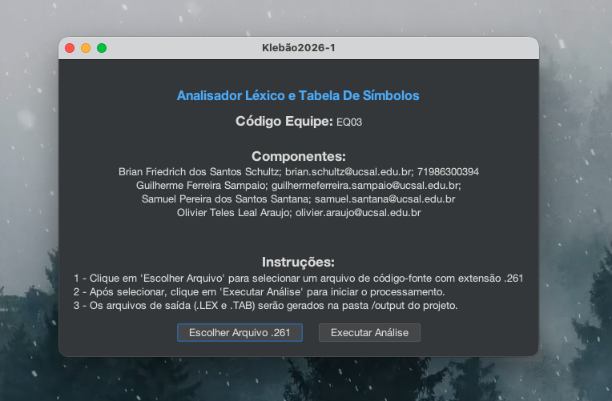
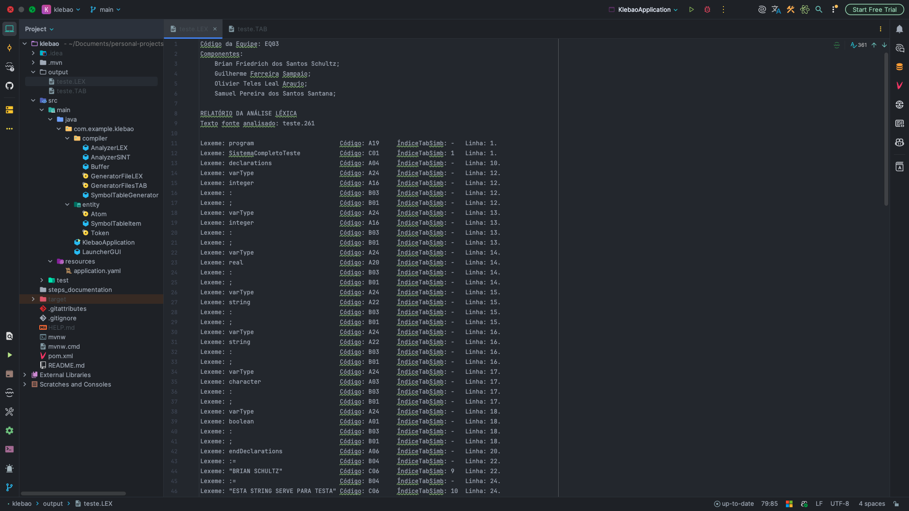
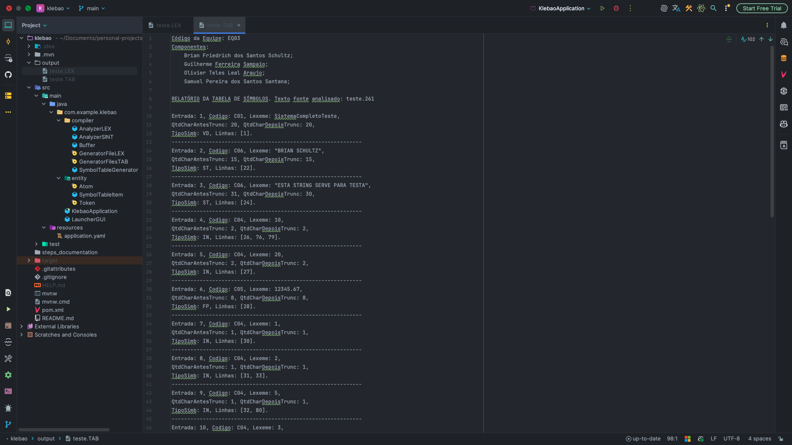
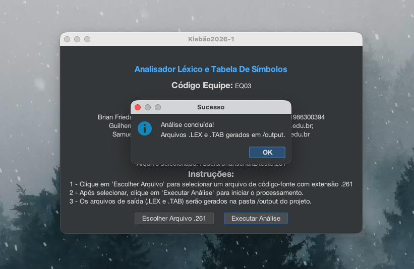

# Klebão - Analisador Léxico & Tabela De Símbolos

Universidade Católica do Salvador 
Disciplina: Compiladores 
Professor: Osvaldo Requião 
Data: 18/06/2026 
Equipe: EQ03 
Alunos: Brian Friedrich dos Santos Schultz, Guilherme Ferreira Sampaio, Olivier Teles Leal Araujo e Samuel Pereira dos Santos Santana. 

## Descrição do Projeto

O **Klebão** é uma ferramenta de análise estática de código. Seu principal objetivo é ler um arquivo fonte .261, realizar a análise léxica, gerar a tabela de símbolos e produzir os arquivos de saída .LEX e .TAB.

## Funcionalidades

- ✅ Ler um arquivo fonte .261
- ✅ Realizar a análise léxica
- ✅ Gerar a tabela de símbolos
- ✅ Produzir os arquivos de saída .LEX e .TAB

O sistema segue uma arquitetura modular e incremental, com etapas bem definidas: leitura do arquivo, análise léxica, geração da tabela de símbolos e gravação dos resultados.

Ele foi projetado para trabalhar com a linguagem de programação definida pelo vocabulário Klebão com regras de truncagem, identificação de tipos e controle de escopo de identificadores. Além disso, o sistema é case-insensitive e filtra comentários e símbolos inválidos.

##  Tecnologias utilizadas

-  Java 21
-  Swing (Java GUI)
-  Maven
-  Lombok
-  IntelliJ IDEA 2025

##  Estrutura Geral do Sistema

O Klebão é composto por quatro etapas principais, refletindo uma arquitetura incremental. Essas etapas são coordenadas pelo **AnalyzerSINT**:

1. 📂 Leitura e Controle do Arquivo Fonte (.261)
2. 🕵️ Análise Léxica
3. 📊 Geração da Tabela de Símbolos
4. 📝 Geração dos Arquivos .LEX e .TAB

Cada módulo interage através do AnalyzerSINT, que centraliza o fluxo de execução.

##  Módulos e Estruturas

### 🧠 `AnalyzerSINT.java`
- Controla o fluxo geral de execução
- Preenche o vocabulário da linguagem alvo
- Inicializa o Analisador Léxico, o Gerador de Tabela de Símbolos e os Geradores de Arquivos de Saída
- Mantém as listas de tokens e itens da tabela de símbolos

### 📚 `Atom.java`
- Contém o vocabulário da linguagem Klebão
- Responsável pela validação de tokens

### 🖱️ `LauncherGUI.java`
- Interface gráfica simples para seleção de arquivo e exibição de feedback de execução
- Permite selecionar arquivos .261 e iniciar a análise

### 📑 `Buffer.java`
- Realiza a leitura do arquivo .261
- Armazena as linhas em memória para análise sequencial

### 🔖 `Token.java`
- Estrutura para armazenar os tokens válidos
- Atributos: lexeme, código, linha, índice na tabela de símbolos

### 🔍 `AnalyzerLEX.java`
- Lê os caracteres do buffer linha por linha
- Remove espaços, tokens inválidos e comentários
- Classifica os tokens com base no vocabulário (Atom.java)
- Implementa contexto para diferenciar identificadores válidos de caracteres inválidos
- Armazena até 30 caracteres do lexema

### 🗂️ `SymbolTableGenerator.java`
- Constrói a Tabela de Símbolos
- Armazena apenas os primeiros caracteres do lexema e as ocorrências no arquivo fonte
- Aplica truncagem em strings, substituindo o último caractere por ", se necessário
- Faz a inferência do tipo dos identificadores com base em declarações anteriores (exemplo: `integer numero`)

### 🧾 `SymbolTableItem.java`
- Representa um item na tabela de símbolos
- Atributos: Número da Entrada, Código, Tamanhos (antes/depois da truncagem), Tipo, Linhas de Ocorrência

### 📝 `GeneratorFileLEX.java`
- Gera o arquivo .LEX com a lista de tokens válidos
- Formata a saída com informações da equipe e detalhes de cada token

### 📝 `GeneratorFilesTAB.java`
- Gera o arquivo .TAB com a Tabela de Símbolos
- Formata a saída com informações da equipe e detalhes de cada símbolo

## 🚦 Fluxo Geral de Execução

1. **LauncherGUI**: Usuário escolhe o arquivo .261
2. **Buffer**: Carrega o conteúdo do arquivo
3. **Analisador Léxico**: Remove comentários/tokens inválidos e monta a lista de tokens válidos
4. **SymbolTableGenerator**: Filtra identificadores, infere tipos e preenche a Tabela de Símbolos
5. **Geradores de Arquivos**: Salva os arquivos .LEX e .TAB na pasta `/output`
6. **Interface**: Exibe mensagens de sucesso ou erro

## ⚠️ Regras e Restrições Importantes

- Sistema case-insensitive
- Limite de 30 caracteres por lexema 
- Múltiplas ocorrências de cada símbolo são armazenadas 
- Comentários (/* */ e //) são filtrados 
- Espaços em branco são removidos 
- Palavras-chave reservadas mapeadas com códigos A-series
- Operadores e símbolos mapeados com códigos B-series
- Identificadores mapeados com códigos C-series

## 🖼️ Interface Swing

A interface gráfica oferece:
- Seleção de arquivo .261 
- Validação de extensão do arquivo
- Feedback visual de sucesso ou erro após análise
- Exibição do caminho absoluto do arquivo selecionado

## 🖼️ Demonstração

## 👨‍💻 Autores

Equipe EQ03:
- Brian Friedrich dos Santos Schultz
- Guilherme Ferreira Sampaio
- Olivier Teles Leal Araujo
- Samuel Pereira dos Santos Santana
